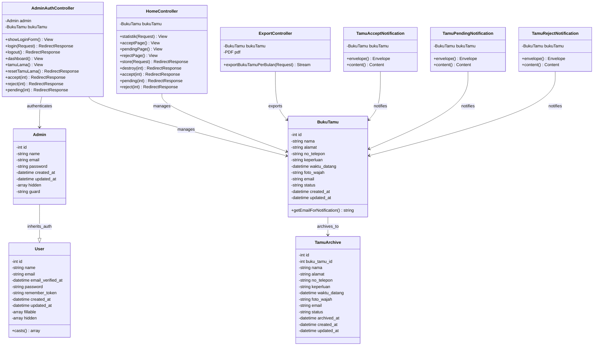

# 📘 Aplikasi Buku Tamu Digital - Laravel 12

Aplikasi **Buku Tamu Digital** berbasis Laravel 12 untuk mencatat kedatangan tamu secara efisien, praktis, dan modern di **Pengadilan Tata Usaha Negara (PTUN) Bandung**. Dilengkapi dengan fitur login admin untuk memantau, mengelola data kunjungan, dan export data ke PDF.

---

## 📋 Daftar Isi
- [Tentang Aplikasi](#tentang-aplikasi)
- [Fitur Utama](#fitur-utama)
- [Teknologi yang Digunakan](#teknologi-yang-digunakan)
- [Use Case Diagram](#use-case-diagram)
- [Database Schema (ERD)](#database-schema-erd)
- [UML Class Diagram](#uml-class-diagram)
- [Cara Instalasi](#cara-instalasi)
- [Troubleshooting](#troubleshooting)

---

## Tentang Aplikasi

**Buku Tamu Digital** adalah solusi sistem informasi modern untuk mencatat dan mengelola kunjungan tamu di PTUN Bandung. Aplikasi ini memudahkan:

- **Pengunjung**: Mengisi data tamu dengan mudah dan cepat melalui formulir sederhana
- **Admin**: Mengelola semua data tamu, melihat status, menyetujui/menolak tamu, dan export laporan ke PDF

Dengan antarmuka yang user-friendly dan sistem berbasis web, aplikasi ini meningkatkan efisiensi pencatatan tamu dibanding metode manual.

---

## ✨ Fitur Utama

### 👥 Halaman Tamu (Public)
- ✅ Formulir pengisian data tamu: Nama, Alamat, Nomor Telepon, Keperluan
- ✅ Upload foto wajah (JPEG/PNG)
- ✅ Penyimpanan otomatis waktu kunjungan
- ✅ Validasi data input
- ✅ Konfirmasi sukses setelah submit

### 🔐 Dashboard Admin
- ✅ Login admin dengan email dan password
- ✅ Melihat daftar tamu yang masuk (pending)
- ✅ Menyetujui/menolak/pending tamu dengan notifikasi email
- ✅ Melihat tamu yang sudah diterima dan ditolak
- ✅ Export data tamu ke PDF per bulan
- ✅ Menghapus data tamu yang sudah lama (>1 tahun)
- ✅ Dashboard statistik: Total tamu, tamu hari ini, tamu per bulan

---

## 🛠 Teknologi yang Digunakan

| Teknologi | Versi | Fungsi |
|-----------|-------|--------|
| **Laravel** | 12.x | Framework backend web |
| **PHP** | 8.2+ | Bahasa pemrograman server-side |
| **MySQL/MariaDB** | 5.7+ | Database relasional |
| **Tailwind CSS** | 4.x | Styling frontend |
| **Vite** | - | Build tool & module bundler |
| **Composer** | - | Package manager PHP |
| **dompdf** | - | PDF generation library |
| **PHPUnit** | 11.x | Unit testing framework |

---

## 📊 Use Case Diagram


### Keterangan Use Case Diagram:

**Aktor Utama:**
1. **Pengunjung (Tamu)** - User yang berkunjung ke PTUN Bandung
2. **Admin** - Pengelola sistem (staff PTUN)

**Use Cases:**

| No. | Use Case | Aktor | Deskripsi |
|-----|----------|-------|-----------|
| 1 | Login | Admin | Admin melakukan login dengan email dan password |
| 2 | Mengisi Data Form Tamu | Tamu | Tamu mengisi formulir data diri (nama, alamat, telepon, keperluan) |
| 3 | Mengambil Foto Wajah | Tamu | Tamu mengambil foto wajah menggunakan kamera/webcam |
| 4 | Submit Data Tamu | Tamu | Tamu mengirimkan data dan foto ke sistem |
| 5 | Melihat Daftar Tamu Pending | Admin | Admin melihat tamu yang baru masuk dan belum diproses |
| 6 | Menyetujui Tamu | Admin | Admin menyetujui kedatangan tamu (status: accept) |
| 7 | Menolak Tamu | Admin | Admin menolak permintaan tamu (status: reject) |
| 8 | Pending Tamu | Admin | Admin menandai tamu sebagai sedang diproses (status: pending) |
| 9 | Mengirim Notifikasi Email | Sistem | Sistem mengirim email pemberitahuan ke tamu setelah status diubah |
| 10 | Export Data ke PDF | Admin | Admin mengexport laporan tamu per bulan ke file PDF |
| 11 | Mengelola Tamu Lama | Admin | Admin menghapus data tamu yang sudah lebih dari 1 tahun |

---

## 📈 Database Schema (ERD)


### Penjelasan Tabel:

**ADMINS** - Menyimpan data admin yang bisa login
- `id`: Primary key
- `name`: Nama admin
- `email`: Email unik untuk login
- `password`: Password terenkripsi (bcrypt)

**BUKU_TAMUS** - Menyimpan data tamu yang berkunjung
- `id`: Primary key
- `nama`: Nama lengkap tamu
- `alamat`: Alamat tamu
- `no_telepon`: Nomor telepon (opsional)
- `keperluan`: Alasan/tujuan kunjungan
- `waktu_datang`: Timestamp otomatis saat submit
- `foto_wajah`: Path ke file foto (disimpan di storage)
- `status`: Status tamu (`pending` = belum diproses, `accept` = diterima, `reject` = ditolak)

**USERS** - Tabel user bawaan Laravel (opsional, untuk future use)

**SESSIONS** - Tabel session management Laravel

**TAMU_ARCHIVES** - Archiving tamu yang lebih dari 1 tahun
- `id`: Primary key
- `buku_tamu_id`: Foreign key ke BUKU_TAMUS
- Semua field sama seperti BUKU_TAMUS untuk keperluan archiving
- `archived_at`: Timestamp saat archiving

---

## 🏗 UML Class Diagram



### Penjelasan Class Diagram:

**Model Classes:**
- **BukuTamu**: Model untuk data tamu yang berkunjung dengan method `getEmailForNotification()` untuk notifikasi
- **Admin**: Model untuk admin system dengan guard authentication khusus
- **User**: Model user bawaan Laravel (optional)
- **TamuArchive**: Model untuk archiving data tamu lama

**Controller Classes:**
- **AdminAuthController**: Handle login/logout admin dan approval tamu dengan notifikasi email
- **HomeController**: Handle CRUD tamu dan filtering by status
- **ExportController**: Handle export data tamu ke PDF

**Notification Classes:**
- **TamuAcceptNotification**: Email notifikasi saat tamu diterima
- **TamuPendingNotification**: Email notifikasi saat tamu pending
- **TamuRejectNotification**: Email notifikasi saat tamu ditolak

**Relationships:**
- Controllers memanage dan mengotentikasi Models
- Notifications mengirim notifikasi untuk BukuTamu
- BukuTamu dapat di-archive ke TamuArchive

---

## ⚙️ Cara Instalasi Step-by-Step

### Prerequisites
- **PHP 8.2+** dengan extension: `gd`, `mbstring`, `pdo_mysql`, `openssl`
- **Composer** (dependency manager PHP)
- **MySQL/MariaDB 5.7+** running
- **XAMPP** atau webserver lokal (Apache/Nginx)

### Langkah 1: Clone Repository dari GitHub

```bash
git clone https://github.com/RyuuKanaeru/ujikomtamu.git
cd ujikomtamu
```

### Langkah 2: Install Dependency PHP dengan Composer

```bash
composer install
```

> ⏳ Proses ini akan mendownload semua package Laravel dan dependencies lainnya (~3-5 menit tergantung koneksi)

### Langkah 3: Setup Environment Configuration

Duplikat file `.env.example` menjadi `.env`:

```bash
copy .env.example .env
# Atau jika pakai Linux/Mac:
# cp .env.example .env
```

Generate application key:

```bash
php artisan key:generate
```

### Langkah 4: Konfigurasi Database

Edit file `.env` dan sesuaikan dengan konfigurasi database Anda:

```env
DB_CONNECTION=mysql
DB_HOST=127.0.0.1
DB_PORT=3306
DB_DATABASE=ujikomtamu
DB_USERNAME=root
DB_PASSWORD=
```

**Catatan:**
- Jika pakai XAMPP default, username adalah `root` dan password kosong
- Database `ujikomtamu` akan dibuat otomatis di langkah migrasi

### Langkah 5: Konfigurasi Storage untuk Upload Foto

Buat symlink untuk folder storage agar foto bisa diakses publik:

```bash
php artisan storage:link
```

Verifikasi folder sudah ada di `public/storage`

### Langkah 6: Jalankan Database Migration

Migration akan membuat semua tabel database secara otomatis:

```bash
php artisan migrate
```

**Output yang diharapkan:**
```
Creating table users ... 50ms DONE
Creating table password_reset_tokens ... 15ms DONE
Creating table sessions ... 25ms DONE
Creating table buku_tamus ... 20ms DONE
Creating table admins ... 15ms DONE
```

Jika ada error, lihat bagian [Troubleshooting](#troubleshooting).

### Langkah 7: Seeding Database dengan Data Admin

Jalankan seeder untuk membuat akun admin default:

```bash
php artisan db:seed --class=AdminSeeder
```

**Admin Default:**
- Email: `admin@ptun.com`
- Password: `password`

> ⚠️ **PENTING**: Ganti password admin setelah login pertama!

### Langkah 8: Install Dependencies Frontend (Optional)

Jika ingin mengubah styling dengan Tailwind CSS:

```bash
npm install
npm run dev
```

### Langkah 9: Jalankan Application Development Server

```bash
php artisan serve
```

**Output:**
```
 INFO  Server running on [http://127.0.0.1:8000].
 
  Press Ctrl+C to stop the server
```

### ✅ Aplikasi Siap Diakses

Buka browser dan kunjungi:

| Halaman | URL |
|---------|-----|
| **Halaman Tamu** | http://127.0.0.1:8000/ |
| **Login Admin** | http://127.0.0.1:8000/admin/login |
| **Dashboard Admin** | http://127.0.0.1:8000/admin/dashboard |
| **Export PDF** | http://127.0.0.1:8000/buku-tamu/export-pdf |

---

## 📤 Fitur Export PDF

Aplikasi dilengkapi fitur export data tamu ke PDF dengan format landscape A4 untuk laporan bulanan.

### Cara Menggunakan Export PDF:

1. Login sebagai admin (http://127.0.0.1:8000/admin/login)
2. Klik tombol **"Export PDF"** di dashboard
3. Pilih bulan dan tahun yang ingin di-export
4. File PDF akan otomatis di-download dengan format: `buku_tamu_MM_YYYY.pdf`

### Fitur Export PDF:

✅ Layout landscape untuk tabel yang lebar  
✅ Semua kolom data terlihat lengkap tanpa terpotong  
✅ Foto tamu ditampilkan dalam PDF  
✅ Status tamu ditampilkan dengan badge warna  
✅ Header PTUN Bandung dan informasi resmi  
✅ Footer dengan tanggal laporan  

### Requirement untuk Export PDF:

**PHP GD Extension** harus aktif agar Dompdf bisa memproses gambar. Jika export PDF error, jalankan:

```bash
php artisan serve
```

Server akan otomatis load PHP dengan GD extension yang sudah di-enable.

---

## 🐛 Troubleshooting

### ❌ Error: "Class 'PDO' not found"

**Penyebab:** PDO extension tidak aktif di PHP  
**Solusi:**
- Edit file `php.ini` (cari path-nya dengan `php --ini`)
- Uncomment baris: `;extension=pdo_mysql` → `extension=pdo_mysql`
- Restart PHP/Server

### ❌ Error: "SQLSTATE[HY000] [2002] No such file or directory"

**Penyebab:** MySQL tidak berjalan atau database belum terbuat  
**Solusi:**
```bash
# Start MySQL (XAMPP)
# Buka XAMPP Control Panel → Start Apache & MySQL

# Atau jalankan MySQL manual jika terinstall
mysql -u root

# Test koneksi:
php artisan tinker
>>> DB::connection()->getPdo();
# Output: PDO Object (berarti berhasil)
```

### ❌ Error: "The PHP GD extension is required, but is not installed"

**Penyebab:** GD Extension tidak aktif saat export PDF  
**Solusi:**
```bash
# Edit php.ini
php --ini
# Output: Loaded Configuration File: C:\xampp\php\php.ini (perhatikan path ini)

# Buka file php.ini dengan text editor, cari baris:
# ;extension=gd

# Ubah menjadi:
# extension=gd

# Restart PHP/Laravel server:
# Stop: Ctrl+C
# Start: php artisan serve
```

Verifikasi GD aktif:
```bash
php -r "echo extension_loaded('gd') ? 'GD AKTIF ✓' : 'GD TIDAK AKTIF ✗';"
```

### ❌ Error: "SQLSTATE[HY000]: General error: 1030 Got error 28"

**Penyebab:** Disk penuh atau permission issue pada storage  
**Solusi:**
```bash
# Pastikan folder storage bisa di-write:
php artisan storage:link

# Hapus cache:
php artisan cache:clear
php artisan config:clear
```

### ❌ Error: "Call to undefined function imagecreatefrompng()"

**Penyebab:** PHP GD extension tidak ter-load  
**Solusi:** Sama dengan error GD di atas

### ❌ Foto Tidak Muncul di PDF

**Penyebab:** Storage symlink tidak terbuat atau path foto salah  
**Solusi:**
```bash
# Buat ulang symlink storage:
php artisan storage:link

# Verifikasi folder public/storage ada:
ls public/storage
# atau di Windows: dir public\storage

# Jika masih error, check path di database
php artisan tinker
>>> BukuTamu::first()->foto_wajah; // lihat path-nya
```

---

## 📂 Struktur Project

```
ujikomtamu/
├── app/
│   ├── Http/
│   │   ├── Controllers/
│   │   │   ├── TamuController.php       # Handle form tamu
│   │   │   ├── AdminController.php      # Handle dashboard admin
│   │   │   └── ExportController.php     # Handle export PDF
│   │   ├── Middleware/
│   │   │   └── AdminMiddleware.php      # Proteksi route admin
│   │   └── Kernel.php
│   ├── Models/
│   │   ├── BukuTamu.php                 # Model tamu
│   │   ├── Admin.php                    # Model admin
│   │   └── User.php
│   └── ...
├── database/
│   ├── migrations/
│   │   ├── create_buku_tamus_table.php
│   │   ├── create_admins_table.php
│   │   └── ...
│   └── seeders/
│       ├── AdminSeeder.php              # Seeder untuk admin
│       └── ...
├── resources/
│   ├── views/
│   │   ├── admin/
│   │   │   ├── login.blade.php          # Form login admin
│   │   │   ├── dashboard.blade.php      # Dashboard admin
│   │   │   └── pdf_buku_tamu.blade.php  # Template PDF
│   │   ├── home/
│   │   │   └── form.blade.php           # Form pengisian tamu
│   │   └── ...
│   ├── css/ & js/
│   └── ...
├── routes/
│   └── web.php                          # Semua route aplikasi
├── public/
│   ├── storage/                         # Folder foto (symlink)
│   └── index.php
├── storage/
│   ├── app/
│   │   └── public/
│   │       └── [foto-tamu]              # Penyimpanan foto
│   └── logs/
├── .env                                 # Konfigurasi environment
├── artisan                              # Laravel CLI
├── composer.json                        # PHP dependencies
└── README.md                            # File ini
```

---

## 🚀 Deployment Production

Jika ingin deploy ke production (server live), baca dokumentasi resmi Laravel 12:
- https://laravel.com/docs/12.x/deployment

**Tips Penting:**
- Set `APP_ENV=production` di `.env`
- Set `APP_DEBUG=false` di `.env`
- Gunakan `.env` yang terpisah untuk production
- Setup SSL/HTTPS
- Backup database secara berkala

---

## 📝 License

Project ini dibuat untuk keperluan akademis dan penggunaan di PTUN Bandung.

---

## 👤 Author

**RyuuKanaeru** - GitHub: [@RyuuKanaeru](https://github.com/RyuuKanaeru)

---

## 📞 Support & Issues

Jika menemukan bug atau masalah, silakan:
1. Buat **GitHub Issue** di repository ini
2. Deskripsikan error detail dan langkah reproduksinya
3. Sertakan screenshot jika memungkinkan

---

**Last Updated:** November 2025  
**Version:** 1.0.0
